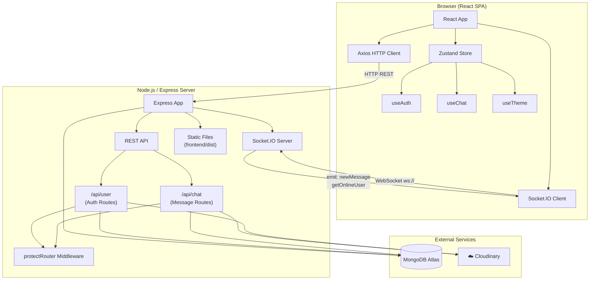

<div align="center">


# 💬 Chatty

### A full-stack real-time chat application built with the MERN stack and Socket.IO

[](https://nodejs.org/)
[](https://react.dev/)
[](https://expressjs.com/)
[](https://www.mongodb.com/)
[](https://socket.io/)
[](LICENSE)

[Features](#-features) · [Tech Stack](#-tech-stack) · [Getting Started](#-getting-started) · [API Docs](#-api-endpoints) · [Deployment](#-deployment) · [Roadmap](#-future-improvements)

</div>

---

## 📖 Project Description

**Chatty** is a full-stack real-time messaging application. Users can create accounts, browse all registered users, and exchange text and image messages instantly via WebSocket connections. The interface supports 32 visual themes, live online-presence indicators, profile photo uploads via Cloudinary, and secure cookie-based authentication with JWTs.

The backend is a single Express server that also serves the compiled React frontend in production, making it easy to deploy as a single unit on platforms like Render or Railway.

---

## ✨ Features

- 🔐 **JWT Authentication** — Secure sign-up, sign-in, and logout with HTTP-only cookie sessions
- ⚡ **Real-Time Messaging** — Instant message delivery powered by Socket.IO WebSockets
- 🖼️ **Image Sharing** — Send images in chat, uploaded directly to Cloudinary
- 🟢 **Online Presence** — Live green dot indicators showing which users are currently online
- 🔍 **Online-Only Filter** — Toggle to show only online users in the sidebar
- 🎨 **32 Themes** — DaisyUI theme engine with live preview on the Settings page (persisted to `localStorage`)
- 👤 **Profile Page** — View name, email, member-since date, and update profile picture
- 📱 **Responsive UI** — Collapsible sidebar on mobile, full layout on desktop
- 🛡️ **Protected Routes** — Route guards on both frontend and backend (JWT middleware)
- 🍞 **Toast Notifications** — Instant success/error feedback via `react-hot-toast`

---

## 🛠️ Tech Stack

### Backend
| Technology | Purpose |
|---|---|
| **Node.js** (v18+) | Runtime |
| **Express 5** | HTTP server & REST API |
| **MongoDB + Mongoose 8** | Database & ODM |
| **Socket.IO 4** | Real-time WebSocket events |
| **JSON Web Token** | Stateless auth tokens |
| **bcryptjs** | Password hashing |
| **Cloudinary** | Cloud image storage |
| **cookie-parser** | HTTP cookie parsing |
| **dotenv** | Environment variable loading |
| **cors** | Cross-origin request handling |

### Frontend
| Technology | Purpose |
|---|---|
| **React 19** | UI framework |
| **Vite 7** | Dev server & bundler |
| **React Router v7** | Client-side routing |
| **Zustand** | Global state management |
| **Axios** | HTTP client (with cookie credentials) |
| **Socket.IO Client** | WebSocket connection |
| **TailwindCSS v3 + DaisyUI v5** | Styling & theme engine |
| **Lucide React** | Icon library |
| **react-hot-toast** | Toast notifications |

---

## 📁 Folder Structure

```
Real-Time-Chat-Application-/
├── package.json              # Root: build & start scripts for deployment
│
├── backend/
│   ├── package.json
│   ├── .env.example          # Required environment variables
│   └── src/
│       ├── index.js          # App entry — Express setup, CORS, static serving
│       ├── lib/
│       │   ├── auth.js       # JWT token generation helper
│       │   ├── cloudinary.js # Cloudinary SDK config
│       │   └── socket.js     # Socket.IO server + online user tracking
│       ├── middleware/
│       │   └── protect.js    # JWT auth middleware for protected routes
│       ├── models/
│       │   ├── user.js       # User schema (name, email, password, profile)
│       │   └── message.js    # Message schema (senderId, receiverId, text, image)
│       └── router/
│           ├── userhome.js   # Auth routes: signup, signin, logout, update, check
│           └── message.js    # Chat routes: list users, get messages, send message
│
└── frontend/
    ├── package.json
    ├── vite.config.js
    ├── index.html
    └── src/
        ├── main.jsx          # React entry point with BrowserRouter
        ├── App.jsx           # Root component with route definitions & auth guard
        ├── index.css         # Global styles
        ├── constants/
        │   └── index.js      # THEMES array (32 DaisyUI themes)
        ├── lib/
        │   ├── axios.js      # Axios instance (baseURL switches dev/prod)
        │   └── utils.js      # formatMessageTime helper
        ├── store/
        │   ├── useAuth.js    # Auth state: login, signup, logout, socket connect
        │   ├── useChat.js    # Chat state: users, messages, send, subscribe
        │   └── useTheme.js   # Theme state persisted to localStorage
        ├── pages/
        │   ├── HomePage.jsx
        │   ├── SignInPage.jsx
        │   ├── SignUpPage.jsx
        │   ├── ProfilePage.jsx
        │   └── SettingsPage.jsx
        └── components/
            ├── Navbar.jsx
            ├── Sidebar.jsx
            ├── ChatContainer.jsx
            ├── ChatHeader.jsx
            ├── ChatInput.jsx
            ├── NoChatSelected.jsx
            ├── AuthImagePattern.jsx
            └── skeleton/
                └── SidebarSkeleton.jsx
```

---

## 🏗️ Architecture Diagram



---

## 🚀 Getting Started

### Prerequisites

- **Node.js** v18 or higher
- **npm** v9 or higher
- A **MongoDB Atlas** cluster (free tier works fine)
- A **Cloudinary** account (free tier works fine)

### 1. Clone the repository

```bash
git clone https://github.com/your-username/Real-Time-Chat-Application-.git
cd Real-Time-Chat-Application-
```

### 2. Configure environment variables

Create a `.env` file inside the `backend/` directory using the example below:

```bash
cp backend/.env.example backend/.env
```

Then fill in your values (see [Environment Variables](#-environment-variables)).

### 3. Install dependencies

```bash
# Install root dependencies
npm install

# Install backend dependencies
npm install --prefix backend

# Install frontend dependencies
npm install --prefix frontend
```

### 4. Run locally (development)

Open two terminals:

**Terminal 1 — Backend**
```bash
cd backend
npm run dev
# Server starts on http://localhost:3000
```

**Terminal 2 — Frontend**
```bash
cd frontend
npm run dev
# Vite dev server starts on http://localhost:5173
```

Open **http://localhost:5173** in your browser.

---

## 🔑 Environment Variables

Create `backend/.env` with the following variables:

```env
# ── Database ──────────────────────────────────────────
# MongoDB Atlas connection URI
mongo_url=mongodb+srv://<user>:<password>@<cluster>.mongodb.net/<dbname>?retryWrites=true&w=majority

# ── Authentication ────────────────────────────────────
# Long random string used to sign JWT tokens
jwt_key=your_super_secret_jwt_key_here

# ── Server ────────────────────────────────────────────
# Port the Express server listens on
# (most hosting platforms set this automatically)
PORT=3000

# Set to "production" when deploying
NODE_ENV=development

# ── Cloudinary ────────────────────────────────────────
# From https://cloudinary.com → Dashboard
CLOUDINARY_NAME=your_cloudinary_cloud_name
CLOUDINARY_API_KEY=your_cloudinary_api_key
CLOUDINARY_API_SECRET=your_cloudinary_api_secret

# ── CORS (production only) ────────────────────────────
# Your frontend domain — required when NODE_ENV=production
FRONTEND_URL=https://your-app.onrender.com
```

> **Note:** The `.env` file is listed in `.gitignore` and will never be committed to version control.

---

## 📡 API Endpoints

**Base URL (development):** `http://localhost:3000/api`

### Auth — `/api/user`

| Method | Endpoint | Auth Required | Description |
|---|---|---|---|
| `POST` | `/user/signup` | ❌ | Register a new user |
| `POST` | `/user/signin` | ❌ | Sign in and receive JWT cookie |
| `POST` | `/user/logout` | ❌ | Clear the JWT cookie |
| `GET` | `/user/check` | ✅ | Verify current session / get auth user |
| `PUT` | `/user/update` | ✅ | Upload a new profile picture (base64) |

**Signup / Signin request body:**
```json
{ "name": "Alice", "email": "alice@example.com", "password": "secret123" }
```

**Signup / Signin response:**
```json
{ "_id": "...", "name": "Alice", "email": "alice@example.com", "profile": "" }
```

---

### Chat — `/api/chat`

| Method | Endpoint | Auth Required | Description |
|---|---|---|---|
| `GET` | `/chat/users` | ✅ | Get all users except the logged-in user |
| `GET` | `/chat/:id` | ✅ | Get conversation history with user `:id` |
| `POST` | `/chat/message/:id` | ✅ | Send a text or image message to user `:id` |

**Send message request body:**
```json
{ "text": "Hello!", "image": "<optional base64 string>" }
```

**Message response:**
```json
{
  "_id": "...",
  "senderId": { "_id": "...", "username": "Alice", "profile": "https://..." },
  "receiverId": "...",
  "text": "Hello!",
  "image": null,
  "createdAt": "2026-07-30T00:00:00.000Z"
}
```

---

### WebSocket Events — Socket.IO

| Event | Direction | Payload | Description |
|---|---|---|---|
| `getOnlineUser` | Server → Client | `string[]` (user IDs) | Broadcast online user list |
| `newMessage` | Server → Client | `Message` object | Push a new message to the recipient |

**Connection:** The client connects with `?userId=<id>` as a query param so the server can map socket IDs to user IDs.

---

## ☁️ Deployment

This project is set up for single-server deployment: Express serves both the API and the compiled React frontend.

### Deploy to Render (recommended)

1. Push your code to GitHub.
2. Create a new **Web Service** on [render.com](https://render.com) pointing to your repo.
3. Set the following in the Render dashboard:

| Setting | Value |
|---|---|
| **Root Directory** | *(leave blank — use repo root)* |
| **Build Command** | `npm run build` |
| **Start Command** | `npm run start` |
| **Node Version** | `20` |

4. Add all variables from [Environment Variables](#-environment-variables) under **Environment → Secret Files or Env Vars**.
5. Set `NODE_ENV=production` and `FRONTEND_URL=https://<your-render-url>.onrender.com`.

> **MongoDB Atlas:** Make sure your Atlas cluster's Network Access allows connections from `0.0.0.0/0` (anywhere), or add Render's outbound IPs.

> **Cloudinary:** Create an upload preset named `message_uploads` in your Cloudinary dashboard under **Settings → Upload → Upload Presets**, or remove the `upload_preset` line from `backend/src/router/message.js`.

### What the build scripts do

```jsonc
// root package.json
"build": "npm install --prefix backend && npm install --prefix frontend && npm run build --prefix frontend",
"start": "npm run start --prefix backend"
```

- `build` installs all dependencies and compiles the React app into `frontend/dist/`.
- `start` runs the Express server, which statically serves `frontend/dist/` in production.

---

## 🧩 Future Improvements

- [ ] **Group chats** — Multi-user conversations and group management
- [ ] **Message deletion / editing** — Per-message actions via context menu
- [ ] **Read receipts** — Double-tick indicators (sent / delivered / read)
- [ ] **Typing indicators** — "Alice is typing…" via Socket.IO events
- [ ] **Push notifications** — Browser Web Push API for messages received while the tab is inactive
- [ ] **Message search** — Full-text search across conversation history
- [ ] **Pagination / infinite scroll** — Load older messages on demand instead of fetching all at once
- [ ] **Rate limiting** — `express-rate-limit` on auth endpoints to prevent brute-force
- [ ] **Input validation** — Schema-level validation with `zod` or `express-validator`
- [ ] **Refresh tokens** — Rotate short-lived JWTs for better security
- [ ] **Unit & integration tests** — Jest + Supertest for the API, Vitest for frontend stores

---

## 📄 License

This project is licensed under the **ISC License**.

---

<div align="center">

Made with ❤️ using the MERN Stack + Socket.IO

</div>